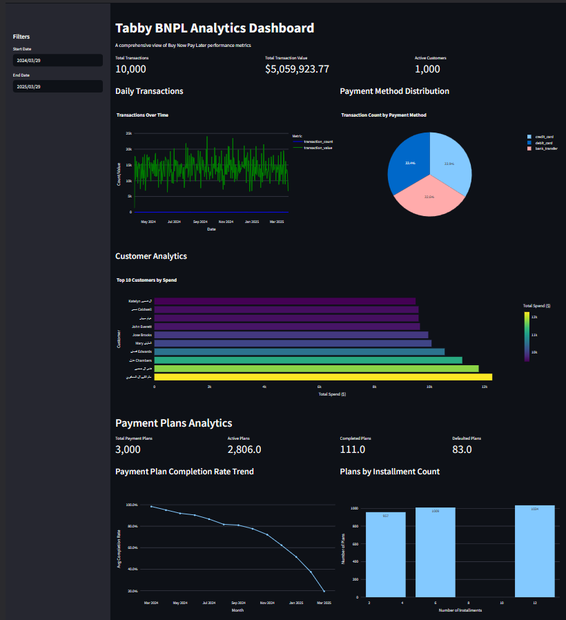
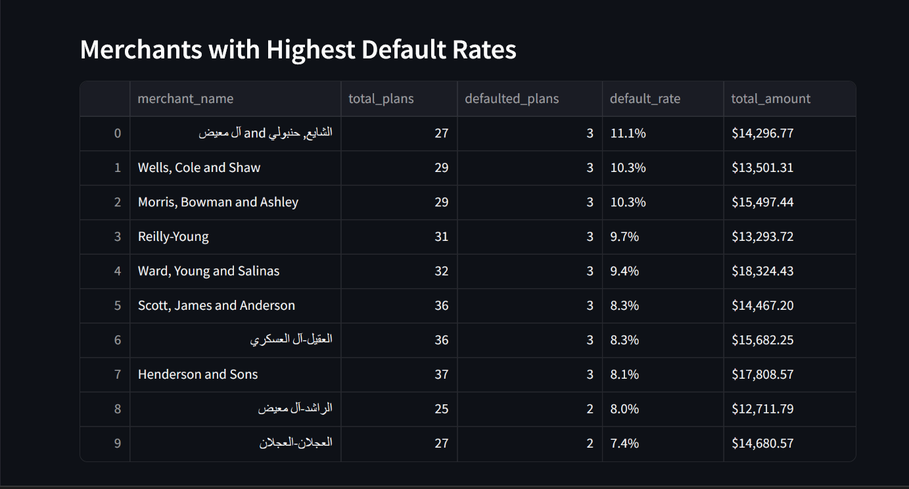

# BNPL Data Warehouse & Analytics Dashboard

A simplified implementation of a data warehouse for a Buy Now Pay Later (BNPL) fintech company, designed to showcase data engineering skills and demonstrate key principles in modern data engineering.

## Project Overview

This project is a scaled-down version of an enterprise data warehouse, implementing a medallion architecture (bronze, silver, gold) using modern data engineering tools and principles. The system integrates data from multiple sources, transforms it through a dimensional model, and creates business-ready analytics for various stakeholders.

The goal of this project is to build an analytical solution for a BNPL company, enabling the business to better understand and analyse customer transactions, payment plans, and merchant activities.


## Features

- **Medallion Architecture**: Bronze (raw data), Silver (dimensional model), Gold (business models)
- **ETL Pipelines**: Data extraction, transformation, and loading processes
- **dbt Transformations**: Modular, testable data transformations
- **Dimensional Modeling**: Star schema implementation with facts and dimensions
- **Business Analytics**: Ready-to-use analytics models for key business domains
- **Interactive Dashboard**: Visual representation of key business metrics
- **Documentation**: Comprehensive explanation of design decisions and implementation details

## Technologies Used

- **Python**: Data processing and scripting
- **PostgreSQL**: Source system simulation for storing transactional data
- **DuckDB**: Analytical database for high-performance querying
- **dbt**: Data transformation framework for building, testing, and maintaining the data models
- **Streamlit**: Dashboard creation for visualizing data insights
- **Pandas**: Data manipulation for cleaning and transforming datasets
- **Plotly**: Data visualization for generating interactive charts and graphs

### Why These Technologies?

- **Python** is widely used in data engineering for automation and scripting, making it an ideal choice for this project.
- **PostgreSQL** is used as the simulated source database for transactional data due to its robustness and flexibility.
- **DuckDB** was chosen for its speed in analytical workloads, making it ideal for performing queries on large datasets.
- **dbt** helps ensure clean and testable data transformations, allowing for modular data pipeline development.
- **Streamlit** simplifies the process of creating interactive dashboards, making it easy to visualize business metrics.

## Key Features

### Data Pipeline

- **Raw Data Ingestion**: Data is ingested from CSV files simulating BNPL transactions and customer details.
- **Data Transformation**: Data is transformed using dbt models to create dimensional models and business-level analytics.
- **Incremental Loading**: Data processing is optimized by only processing new records in incremental batches.
- **Data Quality**: Data validation checks are included to ensure the integrity and consistency of the data.

### ETL Process

The data pipeline performs the following steps:
1. **Extraction**: Data is extracted from source systems (simulated by CSV files).
2. **Loading**: Data is loaded into the bronze layer, representing raw, untransformed data.
3. **Transformation**: The silver layer contains transformed data, organized using dimensional models like star schemas.
4. **Business Models**: The gold layer consists of analytical models ready for business users, providing key insights.
5. **Dashboard Exposure**: Data is exposed through an interactive Streamlit dashboard to provide stakeholders with actionable insights.

### Data Quality

This implementation includes several data quality checks:
- **Null and Consistency Checks**: Ensuring there are no missing or inconsistent values in the data.
- **Referential Integrity**: Ensuring that relationships between tables (e.g., between transactions and customers) are maintained.
- **Business Rule Enforcement**: Checking that data conforms to predefined business rules.
- **Outlier Detection**: Identifying anomalous or extreme values that could indicate errors.

## Data Model

### Bronze Layer

Raw Data: Ingested from source systems (simulated CSV files)

- `customers`: Customer information
- `merchants`: Merchant details
- `transactions`: Transaction data
- `payment_plans`: Details of payment plans
- `installments`: Installment records
- `user_events`: Events from user interactions with the platform

### Silver Layer (Dimensional Model)

#### Dimensions:
- `dim_customers`: Information about customers
- `dim_merchants`: Information about merchants
- `dim_dates`: Time dimension for analysis

#### Facts:
- `fact_transactions`: Transaction records
- `fact_payment_plans`: Payment plan data
- `fact_customer_events`: Data about customer interactions

### Gold Layer (Business Models)

- `gold_customer_analytics`: Insights into customer behavior
- `gold_merchant_analytics`: Insights into merchant performance
- `gold_transaction_analytics`: Insights into transaction patterns
- `gold_payment_analytics`: Insights into payment plan performance

## Data Lineage


Data lineage showing the flow from raw data in the bronze layer through dimensional models in the silver layer to business analytics in the gold layer.

## Dashboard

The interactive dashboard provides insights into key business domains:


- **BNPL Analytics Dashboard** showing transaction metrics, customer insights, and payment plan analytics.

### Key Analytics:

- **Transaction Analytics**: Volume, trends, and merchant performance
- **Customer Analytics**: Segmentation, behavior, and value
- **Merchant Analytics**: Performance, categories, and activity
- **Payment Plan Analytics**: Default rates, installments, and merchant risk


- **Merchant Risk Assessment** showing default rates for payment plans.


## Project Structure

```
├── dashboards/
│   └── tabby_dashboard.py       # Main Streamlit dashboard
├── data/
│   └── raw/                     # Raw CSV data files
├── dbt_project/
│   ├── models/
│   │   ├── gold/                # Business-level aggregated models
│   │   ├── silver/              # Transformed, clean data
│   │   │   ├── dimensions/      # Dimension tables
│   │   │   └── facts/           # Fact tables
│   │   └── staging/             # Initial data staging
│   ├── macros/                  # Reusable SQL macros
│   └── dbt_project.yml          # dbt project configuration
├── scripts/
│   ├── bronze_layer_etl.py      # Data ingestion script
│   ├── generate_sample_data.py  # Creates test data
│   └── setup_postgres.py        # Database initialization
└── README.md                    # Project documentation
```

## Getting Started

### Prerequisites

- Python 3.8 or higher
- PostgreSQL
- Git
- dbt 1.0+
- DuckDB


## Future Enhancements for a Real Implementation

In a production environment, I would expand the solution with the following enhancements:

1. **CI/CD Pipeline**: Implement automated testing and deployment pipelines for continuous integration and delivery.
2. **Data Quality Automation**: Set up automated validation processes to ensure data quality and consistency.
3. **Pipeline Monitoring**: Implement monitoring to track the health and performance of the data pipelines.
4. **Incremental Processing**: Optimize the system to process only new or changed data, improving efficiency.
5. **Security**: Ensure proper authentication, authorization, and data encryption for sensitive data.
6. **Backup & Recovery**: Implement a disaster recovery strategy to protect data integrity.
7. **Performance Optimization**: Improve query performance with techniques like partitioning, clustering, and indexing.
8. **Machine Learning Models**: Integrate predictive analytics to assess customer churn and default risk.

## License

This project is licensed under the MIT License - see the LICENSE file for details.

## Acknowledgements

This project is a portfolio implementation based on a hypothetical scenario at Tabby. It is not affiliated with the actual company and uses simulated data.